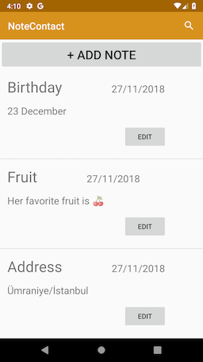
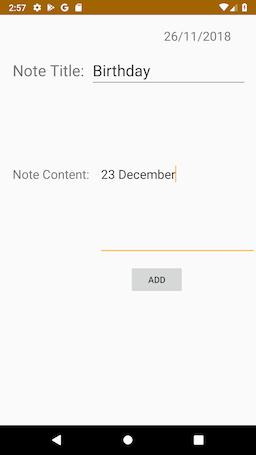
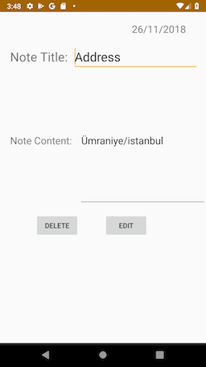
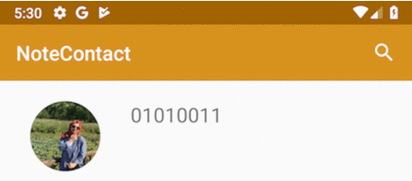

#  NoteContact for Android

 <a href='https://play.google.com/store/apps/details?id=com.canberkozdemir.notecontact&hl=en'></a>

Duzce University Mobile Programming homework (bm443)

Note application that will save you for forgotten birthdays, important dates, addresses and a lot of forgettable information.

# Screenshots

            

# Used Techs

## [Room Persistance Library](https://developer.android.com/topic/libraries/architecture/room "Room Persistance Library") 


Add the dependencies to your gradle file:
```groovy
dependencies {
  implementation "android.arch.persistence.room:runtime:1.0.0"
  annotationProcessor "android.arch.persistence.room:compiler:1.0.0"
}
```

 [NoteContactDatabase](/app/src/main/java/com/canberkozdemir/notecontact/NoteContactDatabase.java)

```java
@Database(entities = {Contacts.class,Notes.class},version = 1)
public abstract class NoteContactDatabase extends RoomDatabase {

    private static NoteContactDatabase noteContactDatabase;
    public abstract IContactDAO getContactDAO();
    public abstract INotesDAO getNotesDAO();

    private static final String DATABASE_NAME="NoteContactDb";

    public static NoteContactDatabase getDatabase(Context context){
        if(noteContactDatabase == null){
            noteContactDatabase =
                    Room.databaseBuilder(context.getApplicationContext(),
                            NoteContactDatabase.class,
                            DATABASE_NAME)
                    .allowMainThreadQueries()
                    .build();
        }
        return noteContactDatabase;
    }
```

 [IContactDAO Contact table interface:](/app/src/main/java/com/canberkozdemir/notecontact/IContactDAO.java)

```java
@Dao
public interface IContactDAO {

    @Insert
    void insertContact(Contacts... contacts);

    @Update
    void updateContact(Contacts... contacts);

    @Delete
    void deleteContact(Contacts... contacts);

    @Query("SELECT * FROM contacts")
    List<Contacts> getAllContacts();

    @Query("SELECT * FROM contacts WHERE phone_number=:phoneNumber")
    Contacts getContact(String phoneNumber);

    @Query("DELETE  FROM contacts")
    void deleteAllContacts();
}
```

  [Contacts table:](/app/src/main/java/com/canberkozdemir/notecontact/Contacts.java)

```java
@Entity(tableName = "contacts")
public class Contacts {

    @PrimaryKey(autoGenerate = true)
    @ColumnInfo(name = "id")
    private int contactId;
    @ColumnInfo(name = "name")
    private String name;
    @NonNull
    @ColumnInfo(name = "phone_number")
    private String phoneNumber;
    @ColumnInfo(typeAffinity = ColumnInfo.BLOB)
    private byte[] photo;

    public Contacts(String name, String phoneNumber, byte[] photo) {
        this.name=name;
        this.phoneNumber=phoneNumber;
        this.photo=photo;
    }

    public int getContactId() {
        return contactId;
    }

    public void setContactId(int contactId) {
        this.contactId = contactId;
    }

    public String getName() {
        return name;
    }

    public void setName(String name) {
        this.name = name;
    }

    public String getPhoneNumber() {
        return phoneNumber;
    }

    public void setPhoneNumber(String phoneNumber) {
        this.phoneNumber = phoneNumber;
    }

    public byte[] getPhoto() {
        return photo;
    }

    public void setPhoto(byte[] photo) {
        this.photo = photo;
    }
}
```

Usage Room Persistance Library:
```groovy
NoteContactDatabase noteDb = NoteContactDatabase.getDatabase(getApplicationContext());
contact = noteDb.getContactDAO().getAllContacts();
```

## [MaterialSearchView](https://github.com/MiguelCatalan/MaterialSearchView "MaterialSerachView") 



MaterialSearchView usage:

```java
private void searchView_onQueryTextListener(){
        searchView.setOnQueryTextListener(new MaterialSearchView.OnQueryTextListener() {
            @Override
            public boolean onQueryTextSubmit(String query) {
                return false;
            }

            @Override
            public boolean onQueryTextChange(String newText) {
                CustomAdapterContactList customAdapterContactList;
                if(newText != null && !newText.isEmpty()){
                    List<Contacts> contactLastFound=new ArrayList<>();
                    Iterator iterator = contact.iterator();
                    while (iterator.hasNext()){
                        Contacts nextContact = (Contacts) iterator.next();
                        if(nextContact.getName().toLowerCase().contains(newText.toLowerCase()))
                            contactLastFound.add(nextContact);
                    }
                    customAdapterContactList = new CustomAdapterContactList(ActivityContacts.this,contactLastFound);
                    cList.setAdapter(customAdapterContactList);
                }else{
                    customAdapterContactList = new CustomAdapterContactList(ActivityContacts.this,contact);
                }
                cList.setAdapter(customAdapterContactList);
                return true;
            }
        });
    }
```

## [CircleImageView](https://github.com/hdodenhof/CircleImageView "CircleImageView") 


CircleImageView Usage:
```xml
<de.hdodenhof.circleimageview.CircleImageView
        xmlns:app="http://schemas.android.com/apk/res-auto"
        android:layout_marginTop="20dp"
        android:layout_marginLeft="30dp"
        android:layout_marginBottom="10dp"
        android:layout_width="70dp"
        android:layout_height="70dp"
        android:id="@+id/photo"
        android:src="@drawable/pp"
        app:civ_border_width="0dp"
        app:civ_border_color="#d7921d"/>
```
